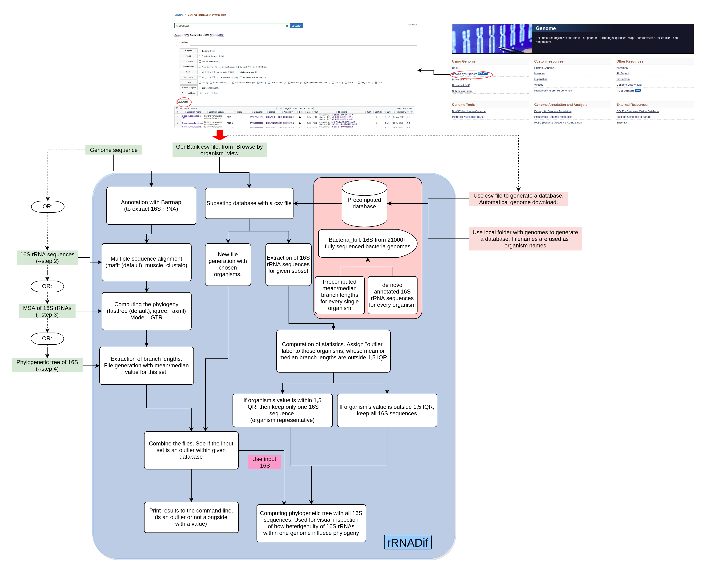

## Background
rRNADif is an automatic pipeline for measuring intragenomic 16S rRNA variability in the input genome sequence. The method itself depends on constructing Maximum Likelihood phylogenetic trees for a set of 16S sequences and as variability measure, we use branch length. Mean and medium branch length variability is then compared to the desired group of organisms. Therefore, this method highly depends on a chosen group of organisms for comparison and visual inspection of a final phylogenetic species tree to answer the question of how the variability effect species representation.

The main advantage of rRNADif is fast and flexible computation of 16S rRNA based species phylogenetic trees from a comprehensive database. Therefore, no misclassified and/or partly sequenced 16S are included, leading to better species/genus-level classification of genomes based on their rRNAs.
## Pipeline
Two inputs are mandatory to the program: genome sequence in fasta format and .csv file from "Browse by genome" tab on Genome component of NCBI. The .csv file is used for subsetting pre-computed database. Note: **If all database if meant to be used, then .csv file should also be provided, containing organisms for an entire database** 
After providing requested files the following steps are performed:
1. Annotating 16S sequences with barrnap from genome 
2. Performing Multiple Sequence alignment of annotated sequences (default mafft. Can use muscle, clustalw)
3. Computing phylogenetic tree (default fasttree. Can use iqtree, raxml. Model is GTR)
4. Extracting branch length information from the tree. Computing mean and median
5. Subsetting a pre-computed database with the .csv file. Extracting sequences and mean/median values per genome
6. Combining mean/median values from annotated 16S with the database ones
7. Calculating statistics.See if values from provided 16S are within 1.5 IQR. If not, there are considered outliers within the compared dataset
8. (optional) Compute phylogenetic tree, where genomes, whose 16S are within 1,5 IQR are represented with one sequence (species representative), while for other genomes all sequences are used.

Better pipeline explanation is provided with the illustration below
 

## What's next?
* To get hands right into the analysis you can start with our [Get_started](get_started.md) guide, using example dataset.
* If you are not happy with algorithm options for MSA of ML tree computation you can check [Non-standard inputs](additional_inputs.md) guide. You can provide .fasta (for MSA)  and .nwk (for a phylogeny) computed files into the pipeline. 
* For output interpretation you can use our [Understand the output](output.md) guide.
* Need to compute final phylogenetic tree and supporting plots? [Create plots and phylogenetic tree](output2.md) guide is here for you!
* pre-computed database from 21000+ fully sequenced bacterial genomes do not serve your purposes? Want to compare to the one taxa with draft genomes included? You can [Create custom database and run analysis with it](database_creation.md). 

## Contributing
Are you get excited by the tool? Do you know how to improve it? For now, this is an individual project with no strict contributing guidelines, therefore feel free to open an issue at GitHub or directly contact me.
An incomplete to-do list of things that can be improved:
* Include other methods of sequence dissimilarity evaluation (maybe there are any just for rRNA). Phylogenetic trees seems an overkill.
* Other statistical techniques for 16S heterogeneity comparison between inputs and database
* Extend the scope to other phylogenetic markers. Make *method for similarity evaluation of duplicated phylogenetic markers in one genome* 
* Make the documentation more fluent and concise 
## Citation
As stated on GitHub repo this is work in progress, so publication is available for now. But if you found this tool valuable, please cite:
P. Hrab & B. Ostash 2020: rRNADif, GitHub repository:[https://github.com/pavlohrab/rRNADif](https://github.com/pavlohrab/rRNADif), doi: [10.5281/zenodo.4390532](https://doi.org/10.5281/zenodo.4390532) 
