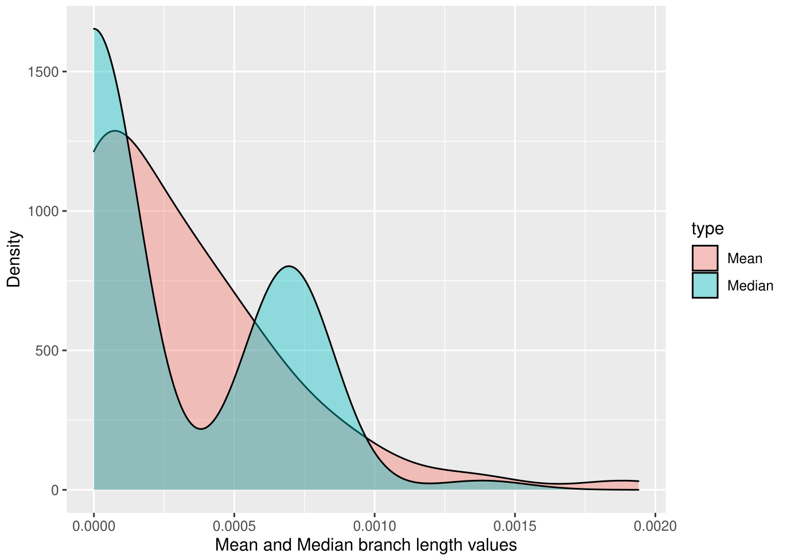

## Compute density plot
One of analysis options is a density plot of analyzed database subset values. **The plot is drawn for non-outliers only.**  Example:


Just use the `--plot` flag with no options. (Boolean one)
```bash
sh rrnadif -d <csv.file> -i <genome.fasta> -p <project-name> --plot
```
:::note
You should install r packages in the environment you are running rRNADif from to draw the plot. Please refer to the [installation](installation.md) guide for more details.
:::

## Compute final phylogenetic tree
The main advantage of rRNADif is fast and flexible computation of 16S rRNA based species phylogenetic trees from the comprehensive database. Therefore, no misclassified and/or partly sequenced 16S are included, leading to better species/genus-level classification of genomes based on their rRNAs. As was stated in [get started guide](get_started.md), final phylogenetic tree can be computed with `--tree` flag.
```bash
sh rrnadif -d <csv.file> -i <genome.fasta> -p <project-name> --tree
```
:::note
The defaults are mafft and fasttree. Also, all sequences are used for outliers and 1 sequence (genome-representative) for non-outlier for giver subset of the database.
:::
 
However, the algorithm for Multiple Sequence alignment or program for phylogeny can be changed with `-m` and `-t` flags respectively. For now, rRNADif supports clustalo, muscle and mafft for MSA, and fasttree, iqtree and raxml for phylogeny. 

```bash
sh rrnadif -d <csv.file> -i <genome.fasta> -p <project-name> --tree -m muscle -t iqtree
```
 
:::caution
By default, branch length for annotated 16S in the input genome will also be computed using provided options, not default ones. Hence, the provided pre-computed database is generated with mafft and fasttree, we suggest to use `--only_phylo` flag. Therefore, only the final tree will be computed with desired algorithms.   
:::
 
The computed phylogenetic tree will contain every strain and therefore can be simply unreadable. To use only species information and compute species-level phylogenetic tree use `--only_species` flag.

In the example below, default options will be used to measure intragenomic variability (construct individual phylogenetic tree) (`--only_phylo` flag), the muscle for MSA and iqtree for phylogeny (`-m` and `-t` flags) will be used for final phylogenetic tree computation. The data for the final phylogenetic tree will contain only species (`--only species`). This would drastically reduce tree size and respective computation time for it, also making tree human readable. 
```bash
sh rrnadif -d <csv.file> -i <genome.fasta> -p <project-name> --tree -m muscle -t iqtree --only_species --only_phylo
```

:::note
Species, when using `--only_species` flag, will be chosen randomly from the database subset (if multiple strains are available). By default, the first in alphabetical order is kept. Prioritized are genomes with multiple rrnas which are non-outliers.
:::
:::warning
If `--only_species` flag is used, intragenomic variability of input 16S will be compared to the whole subset. Strains, that are the same species will be dropped only for the final tree computation.
:::


The output of a run is organized under `<project-name>_results/results/phylogeny` directory. Three files should be there:
1. FINAL.fasta - sequences used for constructing of a phylogenetic tree
2. FINAL.mafft - MSA in fasta format. The extension .mafft is used for the sake of consistency in outputs from different MSA programs. This is **NOT** an indicator of the used algorithm.
3. FINAL.nwk - phylogenetic tree in newick format. Ready to view in almost every phylogenetic tree viewer.

